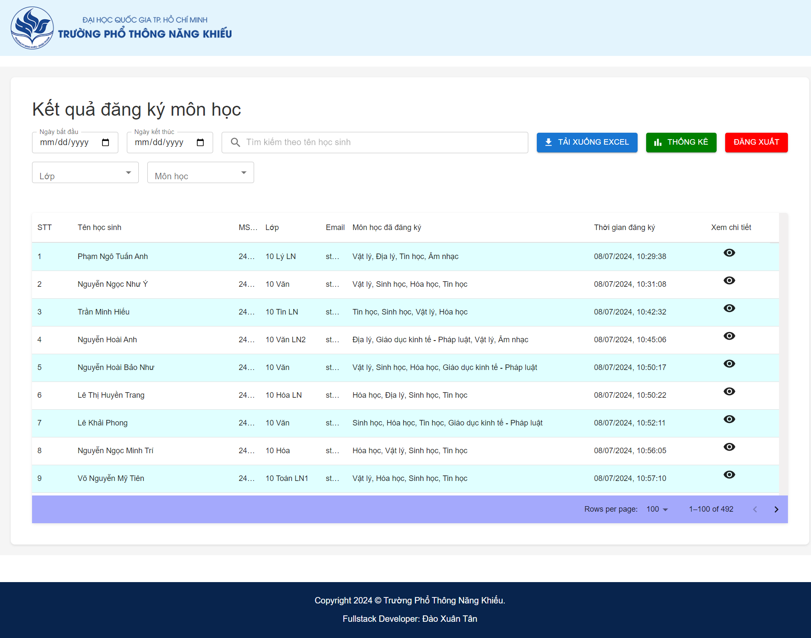

# ĐĂNG KÍ MÔN HỌC DÀNH CHO HỌC SINH KHỐI 10 NĂM HỌC: 2024 - 2025

## Giới thiệu
Ứng dụng được xây dựng để cho phép học sinh khối 10 đăng ký môn tự chọn và nhà trường quản lý kết quả đăng ký.
Link: dkmh.ptnk.edu.vn

## Cấu Trúc Thư Mục
- `client/` - Chứa mã nguồn React cho phần front-end.
- `server/` - Chứa mã nguồn Node.js và Express cho phần back-end.
    - `models/` - Chứa các mô hình MongoDB.
    - `routes/` - Chứa các tệp định tuyến Express.
    - `controllers/` - Chứa các logic điều khiển cho các tuyến.

## Tính Năng

### Người Dùng
**Đăng nhập**: Người dùng đăng nhập tài khoản gmail đuôi @ptnk.edu.vn, nếu không dùng đúng tài khoản email hoặc đúng email nhưng không có trong cơ sở dữ liệu học sinh sẽ không đăng nhập hệ thống được.
**Đăng ký môn học**: Học sinh sẽ được chọn 4 môn học (đối với học sinh lớp chuyên Lý, Hóa, Sinh chỉ chọn 3 môn vì môn chuyên mặc định được chọn và không thể chỉnh sửa) trong 8 môn học. Có thể đăng ký khi chọn đủ 4 môn. Nếu chọn thiếu hoặc quá 4 môn học hệ thống sẽ báo lỗi. Học sinh chỉ được đăng ký 1 lần duy nhất.
**Xem kết quả đăng ký môn học**: Học sinh sẽ được xem chi tiết kết quả đăng ký môn học sau khi đăng ký thành công.

### Admin
**Đăng nhập**: Admin đăng nhập tài khoản gmail đuôi @ptnk.edu.vn, nếu không dùng đúng tài khoản email hoặc đúng email nhưng không có trong cơ sở dữ liệu admin sẽ không đăng nhập hệ thống được.
**Quản lý kết quả đăng ký**: Admin sẽ được xem bảng danh sách kết quả đăng ký môn học theo từng học sinh và có thể xóa kết quả.
**Xem thống kê kết quả đăng ký**: Admin sẽ được xem các biểu đồ về kết quả đăng ký môn học theo từng lớp, từng môn.

## Giao diện

### Trang Đăng Nhập

- **Đăng Nhập**: Đăng nhập bằng tài khoản gmail do nhà trường cung cấp.

- Lỗi khi không dùng đúng tài khoản gmail

### Trang thông tin cá nhân

- **Đăng ký môn học**: Chuyển đến trang đăng ký môn học.

### Trang đăng ký môn học

- Lỗi chọn quá 4 môn học

- Lỗi khi đăng ký mà chưa chọn đủ 4 môn

- Thông báo xác nhận đăng ký

- Thông báo nếu đã đăng ký trước đó

-Thông báo đăng ký thành công

- **Xem kết quả đăng ký môn học**: Chuyển đến trang xem kết quả đăng ký môn học.

### Trang kết quả đăng ký môn học

### Trang dashboard của admin

- **Quản lý kết quả đăng ký**: Chuyển đến trang quản lý kết quả đăng ký môn học.

### Trang quản lý kết quả đăng ký

- **Tải kết quả đăng ký**: Tải danh sách excel kết quả đăng ký môn học.

- **Xem chi tiết kết quả đăng ký của học sinh**: Chuyển đến trang kết quả đăng ký môn học của 1 học sinh.

- **Xem thống kê quả đăng ký của học sinh**: Chuyển đến trang thống kê kết quả đăng ký môn học.

### Trang xem kết quả đăng ký của học sinh
- **Xóa kết quả đăng ký**: Xóa kết quả đăng ký môn học của 1 học sinh.

### Trang thống kê kết quả đăng ký của học sinh

